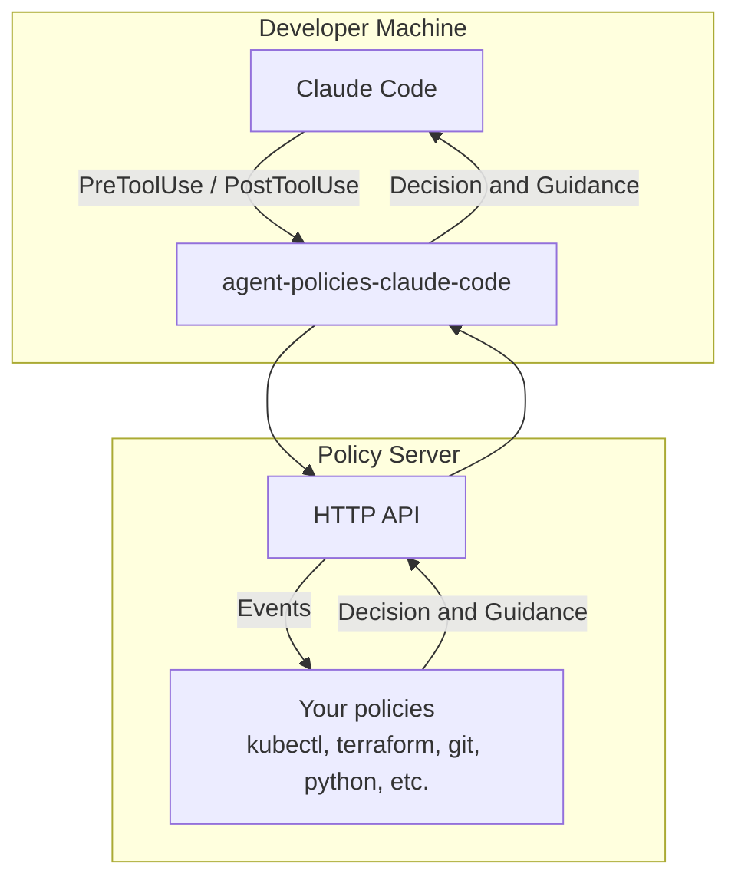

# agent-policies-claude-code

Policies allow your rules, often in natural language, to be expressed as policies; code. The policies are strict guardrails an AI Agent cannot bypass or disregard. Policies allow you to automate decisionmaking as well as guidance for AI Agents, letting them self-correct without interruption.

> This repository contains only the Claude Code client. For the server reference implementation, see [agent-policies-server](https://github.com/Devleaps/agent-policies-server).

## Installation

```bash
# Single session
claude --plugin-dir github:Devleaps/agent-policies-claude-code

# Permanent (user scope)
claude plugin install github:Devleaps/agent-policies-claude-code

# Project scope
claude plugin install github:Devleaps/agent-policies-claude-code --scope project
```

## Architecture



## Configuration

`~/.agent-policies/config.json`:

```jsonc
{
  // Policy server endpoint. Default: "http://localhost:8338"
  "server_url": "http://localhost:8338",

  // Policy bundles to activate. Default: ["universal"]
  "bundles": ["universal", "python", "git"],

  // What to do when the server returns no decision: "allow", "ask", "deny". Default: "ask"
  "default_policy_behavior": "ask"
}
