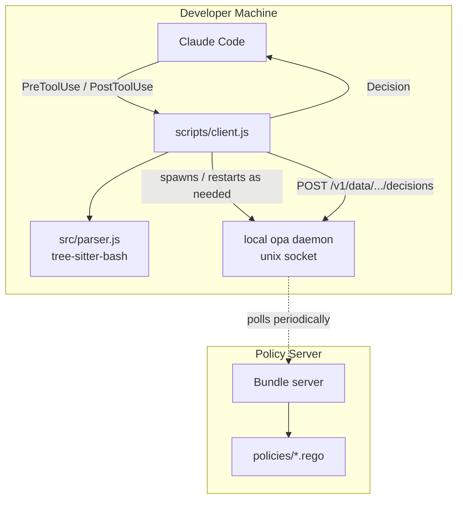

# agent-policies-claude-code

Policies allow your rules, often in natural language, to be expressed as policies; code. The policies are strict guardrails an AI Agent cannot bypass or disregard. Policies allow you to automate decisionmaking as well as guidance for AI Agents, letting them self-correct without interruption.

> This repository contains only the Claude Code client. For the bundle server reference implementation, see [agent-policies-server](https://github.com/Devleaps/agent-policies-server).

## Installation

```bash
claude plugin marketplace add Devleaps/marketplace
claude plugin install agent-policies@Devleaps-marketplace
```

## Architecture

Policy evaluation happens **locally**, in a stock [OPA](https://www.openpolicyagent.org/)
daemon this plugin spawns and manages on your machine. The central server's
only job is composing and serving OPA bundles (`GET
/bundles/composed?names=...`); it never sees your commands.


```mermaid
graph TB
    subgraph "Developer Machine"
        Editor[Claude Code]
        Client[scripts/client.js]
        Parser[src/parser.js<br/>tree-sitter-bash]
        Daemon[local opa daemon<br/>unix socket]
    end

    subgraph "Policy Server"
        BundleServer[Bundle server]
        Policies[policies/*.rego]
    end

    Editor -->|PreToolUse / PostToolUse| Client
    Client --> Parser
    Client -->|spawns / restarts as needed| Daemon
    Client -->|POST /v1/data/.../decisions| Daemon
    Daemon -.->|polls periodically| BundleServer
    BundleServer --> Policies
    Client -->|Decision| Editor
```

On each hook invocation, `client.js`:
1. Parses the command with `src/parser.js` (a real bash AST via `tree-sitter-bash`,
   not a regex). A command the parser cannot fully understand is denied, not
   silently passed through.
2. Ensures a local `opa run --server` daemon is running with the configured
   bundle set (`src/daemon.js`), spawning or restarting it as needed.
3. Queries the daemon directly over a unix socket for a decision.
4. Shapes the result into Claude Code's hook output format (`src/decide.js`).

## Configuration

`~/.agent-policies/config.json`:

```jsonc
{
  // Bundle server endpoint the local daemon polls for policy bundles.
  // Default: "https://agent-policies.devleaps.nl"
  "server_url": "http://localhost:8338",

  // Policy bundles to activate. Default: ["universal"]
  "bundles": ["universal", "python_uv"],

  // What to do when no policy fires a decision: "allow", "ask", "deny".
  // Default: null (defer to Claude Code's own permission system)
  "default_policy_behavior": "ask"
}
```

## Development

```bash
npm test               # Run the test suite (spawns real opa daemons)
npm run build-grammar   # Rebuild vendor/tree-sitter-bash.wasm from source
node scripts/run-corpus.js  # Equivalence check against agent-policies-server's test corpus
```
