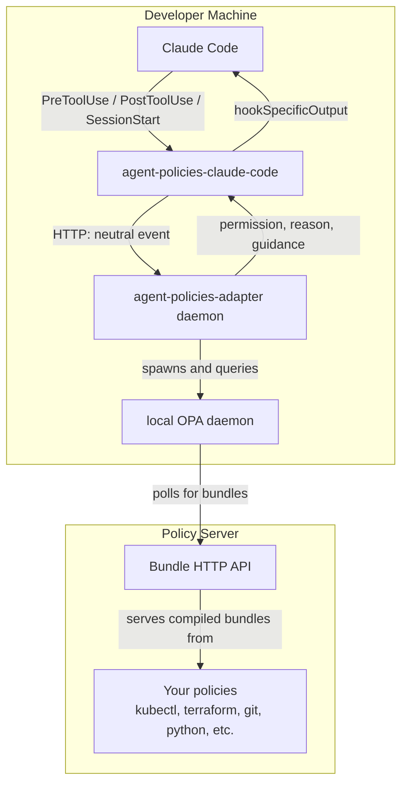

# agent-policies-claude-code

Policies allow your rules, often in natural language, to be expressed as policies; code. The policies are strict guardrails an AI Agent cannot bypass or disregard. Policies allow you to automate decisionmaking as well as guidance for AI Agents, letting them self-correct without interruption.

> This repository contains only the Claude Code client, translating Claude's hook events for [agent-policies-adapter](https://github.com/Devleaps/agent-policies-adapter), which does the actual parsing and policy evaluation. For the server reference implementation, see [agent-policies-server](https://github.com/Devleaps/agent-policies-server).

## Installation

```bash
claude plugin marketplace add Devleaps/marketplace
claude plugin install agent-policies@Devleaps-marketplace
```

## Architecture

This plugin is a thin translation shim - it has no evaluation logic of its own. Every hook invocation shells out to `agent-policies-adapter`, a long-lived local daemon that owns bash parsing, a local OPA daemon, and the evaluation pipeline. The policy server's only job is composing and serving OPA bundles; no session data ever leaves the developer's machine.


```mermaid
graph TB
    subgraph "Developer Machine"
        Editor[Claude Code]
        Client[agent-policies-claude-code]
        Adapter[agent-policies-adapter daemon]
        OPA[local OPA daemon]
    end

    subgraph "Policy Server"
        Server[Bundle HTTP API]
        Policies[Your policies<br/>kubectl, terraform, git, python, etc.]
    end

    Editor -->|PreToolUse / PostToolUse / SessionStart| Client
    Client -->|HTTP: neutral event| Adapter
    Adapter -->|spawns and queries| OPA
    OPA -->|polls for bundles| Server
    Server -->|serves compiled bundles from| Policies
    Adapter -->|permission, reason, guidance| Client
    Client -->|hookSpecificOutput| Editor
```

On each hook invocation, this plugin: translates Claude's `hook_event_name`/`tool_name`/`tool_input` into the adapter's neutral request shape, ensures the adapter daemon is running (spawning it on first use if needed), and maps the adapter's `{permission, reason, guidance}` response back into Claude's hook output contract. If the adapter can't be reached, this plugin falls back to `default_policy_behavior` rather than blocking the editor.

## Configuration

`~/.agent-policies/config.json` (read by the adapter, not this plugin):

```jsonc
{
  // Policy server endpoint. Default: "https://agent-policies.devleaps.nl"
  "server_url": "http://localhost:8338",

  // Policy bundles to activate. Default: ["universal"]
  "bundles": ["universal", "python_uv", "python_pip"],

  // What to do when no policy produces an opinion: "allow", "ask", "deny". Default: "ask"
  "default_policy_behavior": "ask"
}
```
